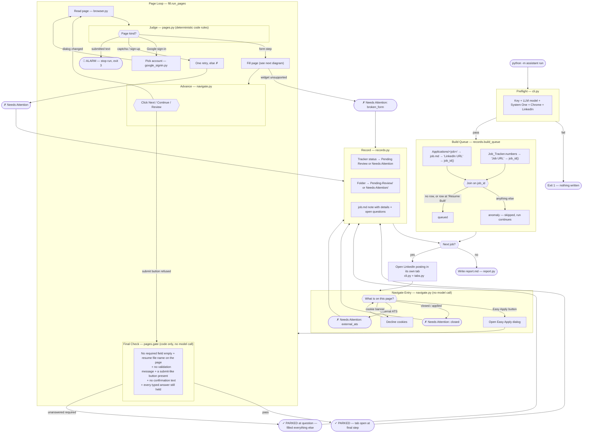
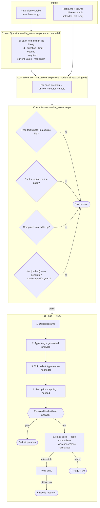
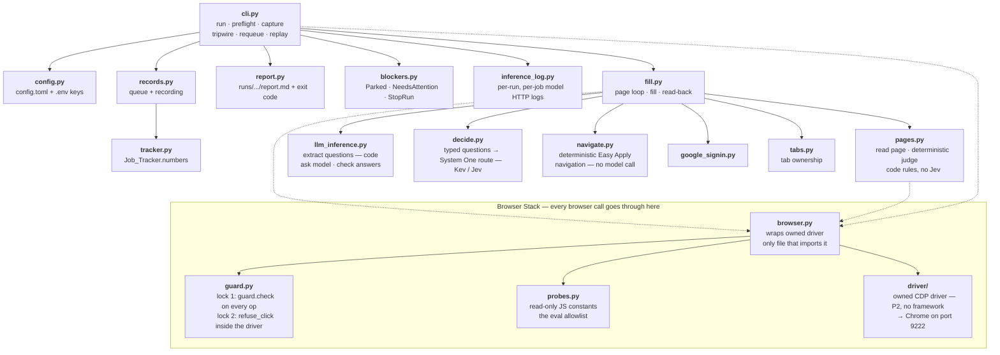
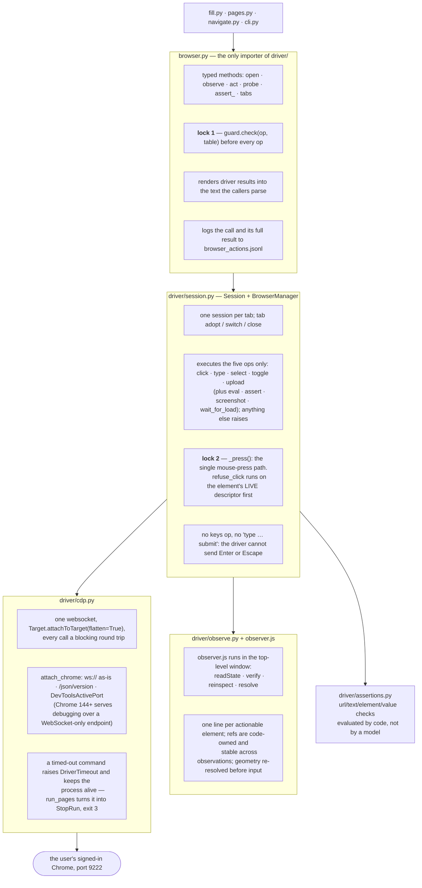
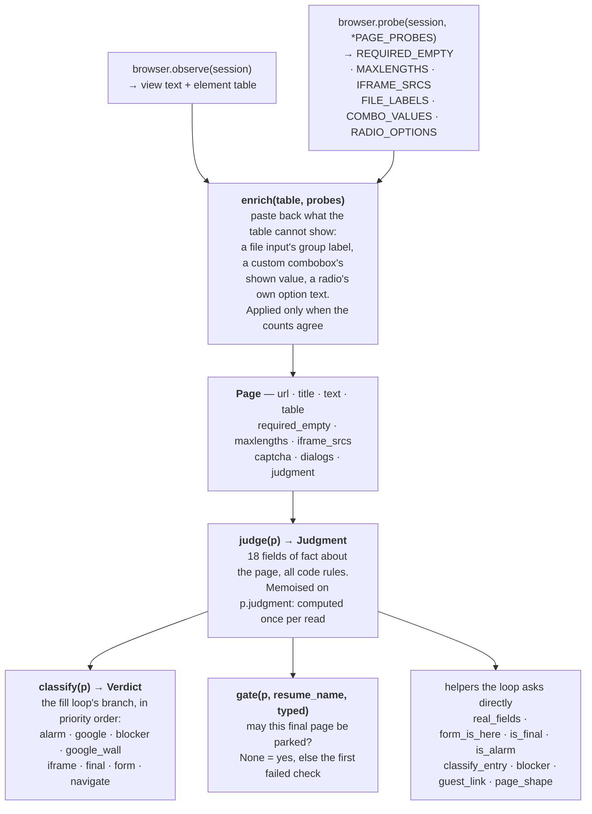

# Application Assistant v2

For every job at Status **Resume Built**, this fills the application in your own signed-in Chrome and **stops one click before submission**. It leaves that tab open for you to review and submit, and records the result. It never submits anything.

- A parked job gets tracker Status **Pending Review**, and its folder moves to `Pending-Review/`.
- A job it can't finish gets **Needs Attention** with a one-line Notes entry, and its folder moves to `Needs-Attention/`. The reason and the open questions are appended to its `job.md` under `# Application Assistant`.
- A job parked **at a question** (a required field the profile doesn't answer) gets Pending Review with Notes `Answer before you submit: <question>`, and the question goes into the report under "Questions for your Scratch Pad".
- Either way, the job's browser tab stays open.

Build spec: [application_assistant_build_spec.md](application_assistant_build_spec.md) (v4.0). Server findings and decisions: [DISCOVERY.md](DISCOVERY.md).

## How it works

Three pictures: what happens to one job, what happens on one form page, and which file does what. The names on the right are the files in `assistant/` that do each step.

**The System One decision model** (a **Kev** server on this Mac, `[models.local]`, serving TypeSafe's System One API) answers the residual ambiguity that code cannot resolve. It is asked under exactly five topics — the `topic` argument of `decide.current().ask(...)` — and nothing else:

| Topic | Caller | What it decides |
|---|---|---|
| `preflight` | `cli.py` | one throwaway yes/no, to prove the route answers before any job starts |
| `navigate` | `navigate.py` | which control starts the application — the **last resort** (step 6 of `enter`), reached only after the Easy Apply button, the closed/applied text, an external Apply and a cookie banner have all failed to match. Its answer is acted on only above `ENTRY_CONFIDENCE` |
| `fill` | `fill.py` | how an answer goes into the form (the op), which field it belongs to, which option it is |
| `fill` | `widgets.py` | which typeahead suggestion is the answer, when more than one starts with it |
| `answers` | `llm_inference.py` | `must_not_generate` (does this ask for a fact only the candidate has?) and total-vs-specific years |

Page classification, the final-step check and the resume/cover-letter input are **not** on that list: P3 turned all three into code rules. Answers are memoised for the length of a run — see [What is cached](#what-is-cached).

**Navigation is deterministic** (`assistant/navigate.py`): no page-kind model call — `enter` decides the posting from the Easy Apply button, closed/applied text, an external Apply, or a cookie banner; `advance` clicks the allowlisted button and waits for the dialog to change. Page classification (`judge()` in `pages.py`) is fully code-based: application fields, required markers, placeholder detection, read-back, settle, signed-out, closed/applied, captcha, final step, and resume/cover-letter input are all decided by code rules.

**The LLM inference** (`assistant/llm_inference.py`) answers each form page. Code extracts the questions from the page's element table (`extract_questions`), and the model receives pre-structured questions (id, kind, options, required, current_value, maxlength) and returns only answers — one call per dialog step.

Its sources are **`Profile.md` and the job's `job.md`**. The tailored resume is uploaded to the form but its text is *not* given to the model (user decision 2026-10-06): a PDF's extracted text was a second, differently-worded copy of the same facts, and the model spliced citations across the two. Anything the form may ask that only the resume answers belongs in `Profile.md` — its `# Scratch Pad` section is the place, one question per line.

Every answer has to carry evidence, and the kind depends on the question. **Free text** needs a quote that is really in a source file, or it is dropped — that is the whole anti-invention guarantee. A **choice** answer carries stronger evidence instead: it has to be one of the page's own options, so it is not dropped for a citation that is not word-for-word (an unverified citation is kept in the record with a note). See [DISCOVERY.md](DISCOVERY.md), 2026-10-06.

The never-submit rule is absolute (`assistant/guard.py`): the driver's single mouse-press path checks every click against the refused-label set (submit/send/confirm/done/finish/complete/apply once filling started) before any click fires. The driver has no op that sends Enter or Escape.

### One job, start to finish



### One form page



### The code



Also in this folder:
- `prompts/`: what the models are told. `llm_inference.md` is the LLM inference prompt (code extracts questions, model answers).
- `assistant/driver/`: the owned browser driver, ported from the vendored package (MIT; see `assistant/driver/LICENSE`).
- `tests/`: see [Tests](#tests).
- `tests/replay/`: the replay harness — offline re-run of a recorded job against its own logs, see [Tripwire and replay](#tripwire-and-replay).
- `runs/`: one folder per run, see [Running](#running).

### The queue: folders joined to tracker rows

`records.build_queue` does not read two independent sources. It reads one list and filters it with the other:

1. **`Applications/` is the list.** Every subfolder is turned into a `Job` by `Job.from_dir`, which needs a `job.md` with a `LinkedIn URL:` line. That URL is reduced to a **`job_id`** by `tracker.job_id`, which is the key for everything that follows: the numeric ID in `/jobs/view/<slug->ID`, else `?currentJobId=ID`, else the normalised URL. It is **never** derived from the folder name.
2. **The tracker is the filter.** Every row's `Job URL` goes through the same `job_id`, and the two sides are joined on that key. The row's `Status` decides whether the folder is queued.

So a job needs a folder to be worked on at all. A tracker row alone cannot produce one, because the folder is where `job.md` and the tailored resume PDF live.

| Folder | Tracker row | Result |
|---|---|---|
| yes | none | **queued**, and the row is created at record time (`Queue.new_rows` → `Recorder.record` → `tracker.add`) |
| yes | `Resume Built` | **queued** |
| yes | any other status | anomaly: `tracker status is '…', not 'Resume Built' — skipped` |
| none | `Resume Built` | anomaly: `tracker row <url> is 'Resume Built' but has no folder — skipped` |
| no `job.md`, or no URL in it | – | anomaly: `no job.md with a LinkedIn URL — skipped` |
| two folders, same `job_id` | – | anomaly: `same job as <other folder> — skipped` (the first one wins) |

The resume PDF is **not** checked here. `job.resume_pdf()` runs later, in `cli.process`, before any browser work: a missing or ambiguous `Amin_*.pdf` is a `NeedsAttention("resume")` for that one job, not a queue anomaly.

`--job URL` and `--limit N` are applied to `Queue.jobs` afterwards (`cli._queue`), so they shrink the work but never change which lines are anomalies.

#### `Report.anomalies`

That list of strings *is* `Queue.anomalies`, copied onto the report in `cli.run`. Nothing else writes to it. It is:

- printed under `Anomalies:` by `run --dry-run`;
- counted in report.md's Summary (`- Queue anomalies: N`) and listed in full under `## Queue anomalies`.

An anomaly **does not affect the exit code**. It means "this folder or row was skipped, look at it yourself" — the run goes on with the jobs that joined cleanly. Do not confuse it with two neighbouring fields:

| Field | Filled by | Meaning |
|---|---|---|
| `anomalies` | `build_queue` | a folder/row pair that could not be queued |
| `warnings` | `cli.process` via `warn=report.warnings.append` | an operational hiccup in a job that was still finished — today the only caller is a job tab that could not be released (`cli.py:234`) |
| `recovered` | `records.recover` | an interrupted record from an earlier run, completed at startup |

### The browser driver (`assistant/driver/`)

**There is no browser framework.** No Playwright, no Selenium, no Puppeteer, no `chromedriver`. The driver is this project's own Chrome DevTools Protocol client: about 1,450 lines of Python plus a 620-line in-page script, and its only runtime dependency is `websockets`. It was ported from a vendored MIT package in P2 and is now owned here (`assistant/driver/LICENSE`).

It also never launches a browser. It **attaches** to the Chrome the user is already signed in to, over one websocket, and it never quits it and never closes a job tab.



What each file is for:

| File | Job |
|---|---|
| `cdp.py` | the transport. One websocket to the browser endpoint, `Cdp.call` / `Cdp.evaluate`, and `attach_chrome`'s three ways of finding that endpoint: `/json/version`, then `DevToolsActivePort`, then `ws://host:port/devtools/browser` (see [If preflight says nothing is listening](#if-preflight-says-nothing-is-listening)). `Target.targetCreated` openers are kept forever, so a tab the page opened can still be told from one the user opened. |
| `session.py` | a tab's lifetime and the op executor. `_press` is the one place a mouse event is produced, so it is the one place the never-submit rule has to hold. `BrowserManager` hands `refuse_click` down to every `Session` it creates. |
| `observe.py` | the element table: `Element`, `Observation`, and the renderer that keeps a read cheap (one line per control, deltas instead of full tables). |
| `observer.js` | the in-page half of that read, injected into the top-level window. It owns the refs, resolves geometry immediately before input, and treats page text as data. P2 carries the live-site fixes: `display: contents` wrappers, topmost-modal-only reads, `opacity: 0` custom controls, ARIA radio/checkbox state, and file-chooser uploads. |
| `assertions.py` | deterministic verification. `DONE` is an opinion; an assertion is a fact. Used for `captcha_present`, among others. |

**The never-submit rule is locked twice**, and the two locks are independent:

- `browser.py` runs `guard.check(op, table)` on every op before it is sent (and `guard.never_click` on the label from the last element table);
- the driver runs `refuse_click` — wired in `browser.py` to `guard.never_click_element` — inside `_press`, against the element's *live* descriptor, so an earlier op in the same batch cannot stale the check. A refusal comes back as `needs_confirmation`.

`tests/test_tripwire.py::test_a_direct_submit_click_is_refused_by_the_driver` bypasses lock 1 on purpose to prove lock 2 by itself.

### `pages.py`: read → judge → classify → gate

`pages.py` holds the program's whole model of "what am I looking at". Its idea is a single one: **turn a page into one immutable `Page` snapshot, then answer every question about that snapshot with code only.** Before P3 those answers came from Jev; now they are regular expressions and set membership, ported from `tests/rule_decider.py` (the test double that had been passing the suite since P2). The section header `# Jev's judgment of a page` is historical — nothing under it calls a model.

Four layers, each built on the one before it:



1. **`read_page`** — one `observe` plus one batched `probe`, then `enrich`. The probes exist because the element table genuinely cannot see some things: Greenhouse names both file inputs "Attach" and puts "Resume/CV" on the surrounding group; react-select keeps its input empty and draws the choice in a sibling; LinkedIn's `div role=radio` options carry the *question* as their accessible name and the option ("Yes") only as their text. `enrich` matches probe output to table rows by DOM order and applies it **only when the counts agree**, so a trimmed probe result is dropped rather than misaligned.
2. **`judge`** — one 18-field `Judgment` dataclass holding every fact the rest of the program needs, so no caller writes its own regex. `kind` comes from `_code_kind`, which is a **first match wins** ladder:

   | Order | Test | Kind |
   |---|---|---|
   | 1 | `ALARM_RE` matches the page text | `confirmation` |
   | 2 | host is `accounts.google.com` | `google_sign_in` |
   | 3 | captcha text, or the `CAPTCHA_PRESENT` probe | `captcha` |
   | 4 | a password field, or a Google button and no real field | `account_wall` |
   | 5 | an HTTP-error title, or an error page with no fields | `error` |
   | 6 | "no longer accepting applications" | `closed` |
   | 7 | a submit-like control and no allowed advance button | `final_step` |
   | 8 | a field inside a dialog, or any real application field | `application_form` |
   | 9 | an "Apply" / "Easy Apply" button | `job_posting` |
   | 10 | a "Continue" / "Next" / "Review" button | `interstitial` |
   | – | none of the above | `other` |

   `PAGE_KINDS` and `GOOGLE_STEPS` above the dataclass are leftover prompt text from the Jev era; they are not read by any code. `MAX_CONTROLS` and `STATE_TEXT` still are, by `page_state`.
3. **`page_state(p)`** — the one thing in `pages.py` that is still *for* the model: the dict that `fill.py`, `navigate.py` and `widgets.py` send as the System One `state` (url, title, open dialogs, up to 120 described controls, the still-empty required fields, 6,000 chars of text).
4. **`classify` / `gate` / the helpers** — the decisions the fill loop acts on. `classify` is deliberately ordered so that a safety stop outranks progress: `alarm` is tested before anything else, and `gate` is the last check before a job is parked. Both are pure functions of the snapshot, which is why `tests/test_pages_unit.py` can run them against saved captures with no browser at all (`page_from_capture`).

`settle` is the one part that re-reads: `unsettled(p)` is true for a page with nothing to act on, and `settle` re-reads once a second for up to 10 s until that stops being true.

### What is cached

Three different things in this codebase are called a cache, and they have nothing to do with each other.

| | `Decider._cache` | `Page.judgment` | the replay fixture caches |
|---|---|---|---|
| Where | `decide.py` | `pages.py` | `tests/replay/harness.py` |
| Holds | System One answers | one `Judgment` | recorded HTTP responses |
| Key | `sha256(topic + fitted state + questions)` | — (one slot) | state+question hash / messages+params hash |
| Lives for | one run | one `read_page` | one replay |
| On disk | no | no | yes, in the run folder it replays |

**`Decider._cache` is the one the logs and the report mean.** `Decider.ask` hashes three things together — the `topic`, the state *after* `fit_state` has cut it to the route's character limit, and the full `questions` dict — and returns the stored answers if that hash has been seen before. Consequences worth knowing:

- It is **in memory and per run**. One `Decider` is installed by `decide.use` at the start of a run and dropped at the end; nothing is written to disk, and the next run starts cold.
- The key includes the questions, so the same page asked a *different* question is a miss. It includes the fitted state, so a page that changed by one character is a miss.
- A **hit costs nothing and logs nothing**. `inference_log.log_jev` is only called from inside `gateway.send`, and a hit never reaches the Gateway — so `jev_inference_logs.json` and the report's call count are *requests*, not *decisions*. A run can therefore show fewer logged requests than it made `ask()` calls.
- **Failures are not cached.** A `DecisionError` is raised before `self._cache[key] = out`, so a retry is a real retry.
- An answer the **chat fallback** produced *is* cached, and is indistinguishable from a System One answer afterwards. Only `Report.by_fallback` records that it happened.
- A judgment split over `MAX_QUESTIONS` is still one cache entry: the parts are merged into `out` before it is stored.

`Page.judgment` is not a cache so much as a guard against accidental cost: `judge()` is called by a dozen helpers for the same page, and memoising it on the snapshot means the regexes run once. It dies with the snapshot.

### `probes.py`: the read-only page scripts

`probes.py` is a module of **string constants** — JavaScript source, no functions that touch the browser (only `parse_eval_results`, which reads results back). That shape is the point, and it buys two things:

1. **It is the eval allowlist.** `guard.check` refuses any `eval` op whose `js` is not literally one of `probes.EVAL_PROBES.values()`. Since the probes are constants, no caller — and no model — can compose a new script to run on the page. There is no probe that writes: every one of them reads and returns.
2. **It sees what the element table cannot.** `REQUIRED_EMPTY` (which required fields are still empty, radio/checkbox groups counted once), `MAXLENGTHS`, `IFRAME_SRCS` (form-looking iframes sorted first), `FILE_LABELS`, `COMBO_VALUES` and `RADIO_OPTIONS`. `CAPTCHA_PRESENT` is the odd one out: it is an *assertion* probe (`ASSERT_PROBES`), run through `browser.assert_`, and it deliberately ignores invisible reCAPTCHA, which sits on many ATS forms and never asks a human anything before submit — which we never reach.

Three details explain how the file is written:

- **`_LIB` is inlined into every probe**, not shared at runtime, because each probe has to stay a self-contained constant to be allowlistable. The helpers in it are the live-site findings: `modalOpen()` picks the *topmost* modal by hit-testing its centre, and `shown()` skips `checkOpacity` for radios, checkboxes and file inputs, because LinkedIn styles those to `opacity: 0`.
- **Every probe trims itself** to `FIT = 190` characters of serialised output, returning `{n, more, items}` so a caller can tell "three items" from "three items shown, more were cut". This began as a server limit (the old vendored server cut an eval value at 200 chars); the owned driver has no such cap any more (`session.py` bounds an eval value at 256 KB), so the trim is now self-imposed, and it is what keeps probe output small enough to paste back into the element table.
- **Chunked probes** (`COMBO_VALUES_0..3`, `RADIO_OPTIONS_0..4`) exist because of that same budget: each chunk carries its offset `o` and the `total`, and `pages.enrich` reassembles them, skipping any chunk that reports `more`.


## Setup (once)

1. **Python environment.** The sibling tools use Poetry, but on this Mac Poetry's pyenv shim is broken, so a plain venv is used:

   ```bash
   cd Tools/Application_Assistant
   /opt/homebrew/bin/python3 -m venv .venv
   .venv/bin/pip install websockets httpx "pydantic>=2" pypdf python-dotenv numbers-parser pytest
   ```

   The browser driver is **owned** in `assistant/driver/` (P2), ported from the vendored package (MIT). Its
   observer carries the live-site fixes the package's patch added:
   - content inside `display: contents` wrappers becomes visible (LinkedIn's job card);
   - only the topmost modal dialog is read (Easy Apply, and its "Save this application?" prompt);
   - custom-styled `opacity: 0` radios, checkboxes and file inputs are listed;
   - ARIA radios and checkboxes report their state;
   - the resume can be uploaded through a file-chooser button (LinkedIn has no file input).

   The only runtime browser dependency is `websockets` (the CDP transport). `poetry install` does the same from
   `pyproject.toml` once Poetry works again.

2. **Keys.** Create `.env` in this folder. It is git-ignored. Both model servers run on your own Mac, so there is
   one key to set:
   - `FREELLMAPI_KEY=<key>`: **required.** The unified key of your [FreeLLMAPI](https://github.com/tashfeenahmed/freellmapi) router, from its Keys page or tray popover. Every chat request uses it (the LLM inference and the chat fallback), and the router answers HTTP 401 without it — which stops the run cleanly rather than failing a job.
   - `KEV_API_KEY=<key>`: only when you started the local Kev server with `KEV_API_KEY` set (a Kev server on `127.0.0.1` is open by default and ignores the header).

   **Nothing costs money**, which is why there is no spend tracking at all: the cost counters, the spend cap and
   the `[prices]` table were removed on 2026-10-07. What runs out instead is a **free tier**, and the quota belongs
   to a *platform*, not a model ID: a 429 reads `All models exhausted: 1 route checked (1 rate-limited or on
   cooldown) … Soonest reset ~22h`. That is why `models.freellmapi.llm_inference` lists models on four different
   platforms — the rotation moves to another platform when one is out. Add more provider keys on the router's
   Keys page to widen the pool. `tests/test_model_access.py` shows, per configured model, whether it is in the
   live catalogue, whether it supports the strict schema, and whether it answers right now.

   **Both servers must be running before a run**: the FreeLLMAPI router (its desktop app or
   `curl -fsSL https://freellmapi.co/install.sh | bash`) and the Kev server (`./run_kev_server.command`).

3. **Config.** `config.toml` is already filled in:

   | Key | Value |
   |---|---|
   | `paths.base` | the repo root |
   | `models.freellmapi.base_url` | your FreeLLMAPI router's OpenAI-compatible endpoint (`http://127.0.0.1:31415/v1`). `config.chat_url` appends `/chat/completions` |
   | `models.freellmapi.llm_inference` | the models tried in turn (`rotation.py`): answers each form page from your files, with reasoning off. A call starts at the model that answered last; one that is out (rate-limited, overloaded, timed out, wrong output) hands over to the next at once. A 429 with a short `Retry-After` (30 s or less) is waited out once. When none answers, the job goes to Needs Attention with every model's reason. A single ID also works. **Name concrete IDs from the router's `GET /v1/models`, never its own `auto`** — `auto` picks whichever free model is up, and one that ignores `response_format` answers prose at HTTP 200, which fails every page. Only a model whose catalogue entry lists `response_format` honours the strict schema. Spread the list over different platforms: that is where the quota lives |
   | `models.local.system_one_decision_model` | `kev-latest`, the Kev server's name for the decision model used for the residual page decisions (`decide.py`). This is the only decision route: the FreeLLMAPI router serves chat only (`POST /v1/systemone` there is HTTP 404) |
   | `models.local` | the Kev server: `base_url` (`http://127.0.0.1:8009`), `system_one_decision_model` (`kev-latest`, the name the server answers to), `state_chars` (12000: Kev was trained on short states and loses accuracy on long ones) and `timeout` (120 s: one pass on an Apple GPU is seconds) |
   | `google.account_email` | `maaz1377.aa@gmail.com` |

   Unknown keys are an error.

4. **Chrome with remote debugging on port 9222**, signed in to LinkedIn (and Google, for the one-click rule). Either:
   - open `chrome://inspect/#remote-debugging` in your normal Chrome and turn remote debugging on, or
   - start a dedicated profile and sign in to LinkedIn and Google there once:

     ```bash
     "/Applications/Google Chrome.app/Contents/MacOS/Google Chrome" --remote-debugging-port=9222 --user-data-dir="$HOME/.chrome-applications"
     ```

   The assistant attaches to this Chrome through the owned CDP driver, which runs inside the assistant's own process. It never quits Chrome, and never closes a job tab.

   `attach_chrome` finds the endpoint by trying three things in order, because the toggle and the flag look
   different from the outside: `/json/version` (what `--remote-debugging-port` answers), then
   `DevToolsActivePort` in Chrome's data directory, then `ws://host:port/devtools/browser` — the browser
   endpoint with no target id, which needs neither an HTTP API nor a readable file. **No Full Disk Access is
   needed**; see below if preflight still cannot find it.

5. **The decision model on this Mac** (the only decision route there is, since 2026-10-07).
   [Kev](https://github.com/jaredpalmer/kev) is a family of small decision models that
   serve TypeSafe's own System One API, so the assistant reaches them exactly as it reached Jev. It needs
   [uv](https://docs.astral.sh/uv) and git; the first start downloads the checkpoint and its Qwen base model into
   `~/.cache/huggingface`, and the server then runs on MLX (Apple Silicon).

   ```bash
   ./run_kev_server.command          # clones/updates ~/kev, then serves kev-0.8b on http://127.0.0.1:8009
   ```

   Leave that window open while the assistant runs. **Kev-0.8B is the size for a 16 GB Mac**; `KEV_MODEL=jaredpalmer/kev-4b ./run_kev_server.command` is more accurate but is a 32 GB machine in Kev's own table. What this buys and what it costs:

   | | Hosted Jev (removed 2026-10-07) | Kev-0.8B here | Kev-4B (32 GB Mac) |
   |---|---|---|---|
   | Accuracy on questions it was not trained on (Kev's README) | 0.857 | 0.648 | 0.817 |
   | Cost and quota | about $0.00002 a decision, a key, a rate limit | none | none |
   | Speed | about 0.3 s a page | hundreds of ms a pass, on your own GPU | slower, and it shares 16 GB with Chrome |
   | Your pages | left the machine | never leave the machine | never leave the machine |

   A smaller model means more jobs in `Needs-Attention/`, not a wrong application: every threshold in
   `decide.THRESHOLDS` still has to be met, and a decision that cannot be got is never guessed. `models.local.state_chars`
   (12000) keeps each page short, because Kev was trained on states of up to 384 tokens and loses accuracy on long ones.
   There is no hosted route to go back to: the cloud System One routes were removed on 2026-10-07, and the
   FreeLLMAPI router that serves the chat models answers HTTP 404 on `POST /v1/systemone`. A bigger `KEV_MODEL` is
   the way to more accuracy now.

6. Check everything:

   ```bash
   .venv/bin/python -m assistant preflight
   ```

   On the local route preflight first reads `GET /v1/models` and prints which checkpoint the server loaded, on
   which backend; if the server is not running it says so and how to start it, and writes nothing.

## Running

```bash
.venv/bin/python -m assistant run --dry-run
```

```bash
.venv/bin/python -m assistant run --no-record --limit 1
```

```bash
.venv/bin/python -m assistant run --limit 3
```

Or double-click `run_application_assistant.command`; arguments pass through.

To try jobs again after a run, put the Needs-Attention ones back in the queue: their folders move back to `Applications/`, their Status returns to Resume Built, and the "Needs Attention: …" line the run added to Notes is removed. `job.md` keeps its notes as the job's history.

```bash
.venv/bin/python -m assistant requeue
```

`--job URL` requeues only that job, and takes the bare job id too. The tracker is backed up to `runs/<time>-requeue/` first.

This is the step a `run --job …` needs when the job last ended in Needs-Attention: `--job` only filters the queue, so a folder sitting in `Needs-Attention/` matches nothing. A run that matches nothing now names the folder it found and the `requeue` command to fix it, instead of working on nothing and exiting 0 (fixed 2026-10-06).

| Flag | Effect |
|---|---|
| `--dry-run` | No browser, no writes, no model calls: prints the queue and its anomalies. The free way to check a `--job` before paying for preflight — it reports an unmatched one exactly as a real run does. |
| `--no-record` | Fills and parks, but writes no tracker row, folder move or `job.md` note. |
| `--job URL` | Only that job. Any LinkedIn URL form works, and so does the bare job id (`4470454940`): all of them reduce to the same `job_id`. It **filters** the queue rather than bypassing it, so the job still needs a folder in `Applications/` and a `Resume Built` row — if nothing matches, the run says why and exits 1. |
| `--limit N` | At most N jobs. |

Each run writes `runs/<YYYYMMDD-HHMMSS>/`, with a `_run/` folder for run-level work (preflight, queue, tab cleanup) and one `<job folder>/` per job:

| File | Contents |
|---|---|
| `report.md` | parked jobs, jobs needing attention, [queue anomalies](#reportanomalies), and questions for your Scratch Pad |
| `journal.jsonl` | the record events |
| `tracker-backup.numbers` | the tracker as it was before the run |
| `_run/`, `<job folder>/` → `jev_inference_logs.json` | every HTTP attempt to the System One decision model (§6.3) |
| `_run/`, `<job folder>/` → `llm_inference_logs.json` | every HTTP attempt to a chat model — LLM inference (§6.2) |
| `_run/`, `<job folder>/` → `browser_actions.jsonl` | every observe/act call to the owned driver, key redacted |
| `<job folder>/` → `answers.json` | every checked answer with its source and quote, with a schema header (when a form page was reached) |
| `<job folder>/` → `screenshot.jpg` | a screenshot of the parked page (when the job parked) |

**Exit codes:**

| Code | Meaning |
|---|---|
| 0 | all parked |
| 1 | preflight failed, or `--job` matched no queued job; no job was worked on |
| 2 | at least one job needs attention |
| 3 | the run was stopped (a safety alarm, LinkedIn signed out, the tracker changed on disk, a folder clash, a hung browser call, a provider outage, or a key/credit failure) |

## How it stays one click short of submitting

1. **One fixed rule** (`assistant/guard.py`, user decision 2026-09-24), enforced by the owned driver's single mouse-press path: a button or link labelled **Submit**, **Send**, **Confirm**, **Done**, **Finish** or **Complete** is never clicked, and one labelled **Apply** is not clicked once the form is being filled. Before that, "Apply" / "Easy Apply" is how the code starts the application. The driver checks every click against `guard.never_click_element` before any mouse event fires; a refused click comes back as `needs_confirmation`, and in the form it marks the last step, where the job is parked. The driver has no op that sends Enter or Escape.
2. **The code's own ops** run only read-only scripts from `probes.py`, never an upload onto a submit-like control, and never `confirm`.
3. **Alarms stop the run** (exit 3) if confirmation text appears on the page.

## Tripwire and replay

Two offline modes. Neither needs the user's Chrome, and neither writes to a job, a folder or the tracker.

### `tripwire` — prove the rule, don't argue it

```bash
.venv/bin/python -m assistant tripwire
```

The claim "it never submits" is worth nothing as a code review, so the tripwire tries to break it. It runs `tests/test_guard.py` and `tests/test_tripwire.py` in a throwaway headless Chrome on port 9223, against four local fixture forms whose **submit button really posts** to a local server that records every POST (`f01` Submit application, `f02` multi-step, `f03` Apply, `f05` Send application).

`walk()` then does the most hostile thing it can: for six rounds it types into every field and clicks every button on the page, advance buttons first, with `guard.FORM.started = True` so the form counts as being filled. Three assertions make it a proof rather than a demo:

| Assertion | What it rules out |
|---|---|
| `fixture_server.posts() == []` | nothing was ever sent |
| `result["refused"]` is non-empty | the walk actually reached a submit control, instead of passing vacuously |
| every refusal matches `guard.never_click_element`, every click does not | the driver and the rule agree exactly — no over- and no under-blocking |

A fourth test, `test_a_direct_submit_click_is_refused_by_the_driver`, reaches past `browser.act` into `browser._session(...)` to order the click directly. That deliberately bypasses lock 1 (`guard.check`) so that lock 2 (`_press` → `refuse_click`) is proved standing alone.

Three fixtures are left out of the walk list: `f04` (sends on Enter), `f06` ("Confirm my choices" in a cookie banner) and `f07` ("Done"). Only `f04` still has a live reason — the driver has no op that can send Enter at all, which `test_guard.py` covers separately. The docstring's explanation that `f06` and `f07` are "outside the rule" **predates the current `REFUSE_LABEL_RE`**, which now matches `confirm` and `done`; and `f06`'s plain `<div role=dialog>` is not one of the CMP containers in `observer.js`'s `CONSENT_SELECTOR`, so it does not get the cookie-consent exemption in `guard.never_click_element` either. Both buttons would in fact be refused today — they are simply not in `TRIPWIRE`.

> **`tripwire --live` currently adds nothing.** It appends `--live` to the pytest run, but neither `test_guard.py` nor `test_tripwire.py` has a `live_model` test any more — the goal-driven tripwire was replaced by the direct-click test when the owned driver removed the goal path (P2). The flag is a no-op until a live test is added back.

### `replay` — re-run a recorded job with no browser and no network

```bash
.venv/bin/python -m assistant replay runs/20260105-141230/<job folder>
```

Every run already writes enough to reconstruct itself: `browser_actions.jsonl` (every driver call and its full result), `jev_inference_logs.json` and `llm_inference_logs.json` (every model attempt, request and response). Replay feeds those three files back into the **real** `fill.run_pages`, so the logic under test is the production code path and only its two edges are faked:

- **`ReplayBrowser`** duck-types `Browser` and hands back the recorded results in order. It is not a passive tape: `act()` still runs `guard.check` on every op, so a replay re-proves the never-submit rule on a real recorded page.
- **`replay_gateway_post`** is installed as the Gateway's `post`, and matches by content, not by order: a System One request by `sha256(state + questions)`, a chat request by `sha256(messages + parameters)` with `model` excluded, so a model swap still hits.

It does need the job's **folder** to still exist: `_find_job_dir` looks for a directory whose name starts with the `job_id` in `Applications/`, `Pending-Review/` or `Needs-Attention/`, and reads `job.md`, the `Amin_*.pdf` resume and `Profile.md` from it. A job that has been submitted and archived out of those three directories can no longer be replayed, however complete its logs are.

It prints a funnel — pages visited, fields filled, dialogs advanced, final result — plus hit/miss counts, which is what makes it useful: change a rule in `pages.py` or `fill.py`, replay a job that went to Needs-Attention, and see whether it now parks.

> **`replay --live` does not call a live API.** Despite the flag's help text, `replay_gateway_post` raises `ReplayMiss` on an unmatched model request in *both* modes, and nothing writes back to the fixture. All `--live` changes is `ReplayBrowser`: in strict mode a browser call that does not match the next recorded entry raises; with `--live` it skips forward to the next matching one. Treat it as "lenient", not "live".

## If preflight says nothing is listening

Check that something really is:

```bash
lsof -nP -iTCP -sTCP:LISTEN | grep 9222
```

If Chrome is in that list, the port is fine and the problem is elsewhere — preflight no longer depends on
`/json/version` answering or on `DevToolsActivePort` being readable, so neither a 404 nor a macOS permission
error on Chrome's data directory can hide a live server any more (fixed 2026-10-06; both used to, together, and
the error then blamed the `chrome://inspect` toggle that was already on). If Chrome is **not** in that list, the
debugging server is genuinely off: re-open `chrome://inspect/#remote-debugging` and check that it still says
"Server running at", or start the dedicated profile from step 4 above.

## Known limits

See [DISCOVERY.md](DISCOVERY.md):
- **Typeahead comboboxes** are filled by `widgets.py` (type, poll for `role=option` suggestions, pick the match), but only when LinkedIn renders the suggestion list inside the modal's own subtree. If it renders in a portal outside the dialog, no suggestion is ever seen and the field becomes a `broken_form` — unverified live, see the module docstring.
- Inputs without a `type` attribute are invisible to the observer, so such a required field ends in Needs-Attention.
- Chrome asks you to **allow** each new remote-debugging connection in `chrome://inspect` mode. Preflight waits up to 180 s for you to click Allow; after that the run stops with exit 3.
- Workday and similar sites need an account. The program tries your Google one-click sign-in; if the site then asks to register or accept terms, the job goes to Needs-Attention.
- Read-only date pickers can't be set.
- A custom dropdown shows its options only once opened, so an answer for it can't be checked against the page and is dropped ("answer not on the page").

## Tests

```bash
.venv/bin/pytest -m unit -q
```

```bash
.venv/bin/pytest -q
```

```bash
.venv/bin/pytest -q --live
```

- `-m unit`: no browser, no network.
- Plain `pytest`: adds `browser` tests, run against a throwaway headless Chrome on port 9223 and local fixture pages only. `tests/test_model_access.py` also runs here and calls your FreeLLMAPI router for real (free; it needs the router running).
- `--live`: adds `live_model` tests. They call both servers on this Mac for real — the FreeLLMAPI router for the chat models and the Kev server for the decisions — so **both must be running**, and `.env` needs `FREELLMAPI_KEY`. Still against local fixtures and saved pages only.
- **Replay** (`tests/test_replay.py`): unit tests for the harness itself. The harness is driven for real by `python -m assistant replay` — see [Tripwire and replay](#tripwire-and-replay) for what `strict` and `--live` actually do.
- Offline, the decision model's questions are answered by `tests/rule_decider.py`, a stand-in built from the rules the program used before Jev. The program itself never uses those rules.

Real pages for the classifier tests come from `capture` (see [LIVE_TEST.md](LIVE_TEST.md)).
